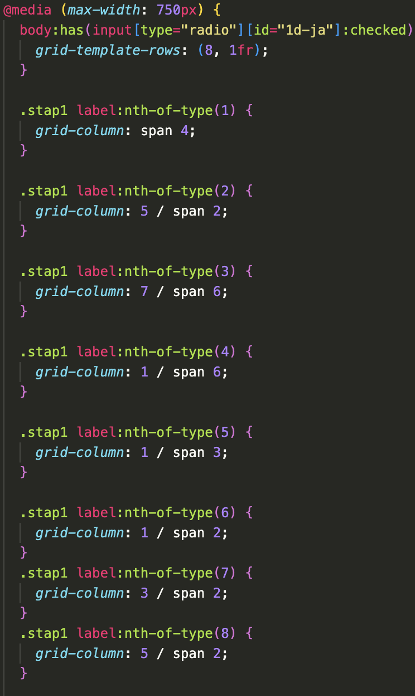

# WDD-BT
 
<h2>Week 1</h2>

Deze week is de intro van BT, helaas heb ik de eerste oefening gemist vanwege een zieke dag.

Wel heb ik de intro van de final assessment meegekregen, waardoor ik de opdracht met alle uitleg duidelijk heb kunnen volgen.

Ik ben op de eerste dag begonnen met het maken van een overzicht van wat ik allemaal op mijn erfbelasting-site wil. Hierbij keek ik naar de verschillende inputtypes en wat ik nog interessant vind om te optimaliseren qua UX. Hieronder is het resultaat:

Verder ben ik begonnen met het bestuderen van de huisstijl van NS. Uit dit overzicht heb ik mijn basis gemaakt. Een leerdoel van mij is om nette code te schrijven die goed overzichtelijk blijft. Dit was ook de bedoeling bij het starten met mijn HTML en CSS. Hierbij vond ik het voor mijzelf belangrijk om in het begin de grid layout van NS over te nemen, zodat deze in één keer goed staat voor de rest van de site. Verder heb ik de kleuren toegevoegd en de eerste twee pagina’s als opzetje gemaakt.

De eerste feedback van deze week was nog niet heel veel. De code zag er prima uit en de huisstijl was al goed aanwezig.

<h2>Week 2</h2>

In week 2 was het voor mij de bedoeling om de responsiveness alvast aan te pakken. Doordat ik gebruikmaakte van de grid van NS was het vrij eenvoudig toe te passen. Een nadeel dat ik tegenkwam, is dat ik, met de werkwijze die ik heb, een vrij lang CSS-document aan het creëren ben, doordat ik veel grid-regels heb. Zoals je kunt zien op de onderstaande foto.

Verder heb ik gewerkt aan de vragen waarbij er wel of niet meerdere opties in beeld komen. Zodra je op sommige vragen van het PDF-document "ja" antwoordt, moet je meer vragen invullen. Uiteraard is dit voor UX-designers een interessant onderwerp, omdat je hiermee tijd kunt winnen voor de gebruikers die deze extra vragen niet hoeven in te vullen. Ik heb de vragen ingesteld met behulp van :has. Zoals je in de code kunt zien, is het een normaal blok dat standaard op `display: none;` staat. Hierdoor is het niet zichtbaar, maar ook niet voor screenreaders. Zodra het juiste vakje is aangevinkt, wordt het pop-upblok op `display: block/grid;` gezet om het in beeld te brengen. Nu worden deze blokken dus wel meegenomen door de screenreaders.

Verder heb ik deze week nog de radio buttons een stijl gegeven in de vorm van NS.

Ook de feedback die ik hierop kreeg was vrij positief. De stijl van NS was al goed uitgewerkt en de pop up blokken zagen er goed uit. Wel kreeg ik nog een denkwijze mee om meer aan progressive enhancement te voldoen. Wat als :has niet werkt.

<h2>Week 3</h2>

In week 3 heb ik naar mijn mening niet heel grote voortgang kunnen maken. Ik heb namelijk veel tijd besteed aan een buggy Fieldset die ervoor zorgde dat ik in de tag van de fieldset geen `display: grid` kon gebruiken. Tenminste, het kan wel, maar het werkt niet altijd zoals ik wilde. Zoals je op de foto kunt zien, als ik over de fieldset hover met de grid, zie je de gridlijnen niet in de inspector, terwijl dit bij andere elementen wel duidelijk zichtbaar is. Zodra ik een label in de fieldset een span van 1 wilde geven, werd deze niet goed meegenomen, waardoor de 1fr van de grid column groter werd zonder dat ik dat wilde. Uiteindelijk, nadat ik had ontdekt dat het aan de fieldset lag, heb ik een div eronder gebouwd waar de content in komt te staan en daar de grid op gezet.

Een ander onderdeel waar ik mij mee bezig hield, is het maken van een backup voor de pop-ups met behulp van :has, zodat elke browser ondersteund wordt, mocht :has niet beschikbaar zijn. In de onderstaande code vertel ik eigenlijk dat het pop-upblok standaard zichtbaar is. Mocht de :has-functie uiteindelijk wel ondersteund worden en er nog niks aangevinkt zijn, dan wordt de display op `none` gezet. Zodra de juiste radio button is aangevinkt, komt de pop-up weer in beeld.

Verder heb ik deze week de tweede pagina van mijn formulier uitgewerkt en een klein stukje JS-script geschreven voor het berekenen van de breuk naar procent.

Dit is een klein geautomatiseerd stukje om de gebruikerservaring te verbeteren. Mocht JS bij een gebruiker niet werken, is deze functie niet meer aanwezig, maar dit zal de uiteindelijke code niet verstoren. Een kleine verbetering dus.

Ook had ik een eerste opzetje gemaakt voor valid en invalid velden, hoe dit getoond wordt.

De feedback kregen we van de weekly nerd die als eerste heel lovend was over de manier hoe ik de :has had opgelost. Dat was volgens hem de perfecte manier om dat te tackelen. Verder kreeg ik nog een feedback punt waarbij ik de invalid en valid status niet alleen met kleur moet laten zien doordat groen en rood voor sommige kleuren blinden niet uit elkaar te halen zijn. Een vinkje een een kruisje zouden hier goed te pas komen.

<h2>Week 4</h2>

De laatste week was vooral gericht op het afmaken van de laatste dingetjes. Als eerste was het heel belangrijk om mijn local storage op te lossen. Hierin had ik nog niks geprobeerd, maar na wat rondvragen over hoe anderen het gedaan hadden, kwam ik op het volgende stukje code uit:

Verder heb ik deze week mijn invalid en valid inputs verbeterd met de feedback van de week ervoor. Ik heb de validatie ook een zichtbaar icoon gegeven in plaats van alleen kleur. Het ziet er nu als volgt uit:

De iconen zijn achtergrondafbeeldingen die je niet laat herhalen.

Ook deze week kwam ik weer een beetje in de problemen met de responsiveness, maar daar heb ik weer wat rechtgetrokken. Helaas ben ik er op deze manier wel achter gekomen dat mijn responsiveness rommelig is en dat ik dit in volgende projecten veel beter moet aanpakken.

Voor de berekening van de breuk naar procenten heb ik nog een kleine aanpassing kunnen doen die voor mij nieuw was, namelijk de decimalen achter een getal. Mocht het bijvoorbeeld 1/3 zijn, dan is het percentage 33,3333 enz., maar nu is dit altijd maar 1 getal achter de komma:

Als allerlaatste heb ik mijn code nog een beetje opgeruimd en de juiste notaties toegevoegd, zodat deze zo duidelijk mogelijk leesbaar is.